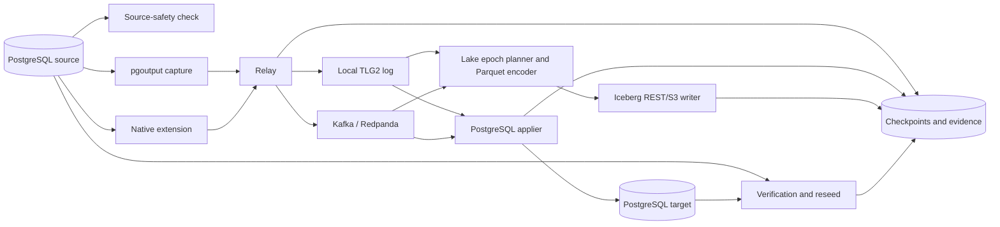

# Trellara Design

Status: authoritative design for the current repository

Last reconciled: 2026-09-01

Protocol version: `1`

Configuration version: `2`

This document is the single design reference for the repository. It replaces nine separate memos
that previously lived in `docs/` — the protocol RFC, the pgoutput implementation design, the initial
snapshot state machine, the embedded transport design, the production configuration and
production contract-lock notes, the native PostgreSQL extension design, the Iceberg integration
design, and the lake fan-in completeness contract. Their normative content is folded in here; the
files themselves are gone, and nothing in the build or test tree refers to them. It describes what
the code implements now, what is feature-gated, and what remains proposed.

## How to read this document

The source-of-truth order is:

1. serialized types, protobuf schemas, validation code, and database schemas;
2. compatibility fixtures and tests;
3. CLI help and configuration validation;
4. crate `README.md` and `skills.md` files;
5. this design explanation.

If this document conflicts with executable contracts, the executable contract wins and this document must be corrected. Product direction and unfinished work live in [ROADMAP.md](ROADMAP.md), not here.

**This file is a build dependency.** Three test modules `include_str!` it and assert exact phrases —
`trellara-protocol` (protocol version, the three boundary-mode names, the event key format, the two
compact invariants), `trellara-stream-local` (the transport heading, `TLG2`, `LocalDurability::Fsync`,
torn tail, cursor persistence, the two local-stream commands), and `trellara-checkpoint` (the
snapshot heading, the three snapshot tables, the nine state names, the crash case). Several
`quickstart_*_artifacts.rs` freshness gates read it at runtime under
`make quickstart-proof-check`. Renaming a heading or rewrapping a quoted sentence in this document
can fail the build. After editing, run `cargo test --workspace` **and**
`make quickstart-proof-check`.

## Product boundary

Trellara is a source-safety and verified replication layer for PostgreSQL. Its job is to make a replication boundary inspectable and recoverable:

- determine whether a PostgreSQL source is safe to capture;
- preserve committed transaction identity and ordering;
- acknowledge source WAL only after a durable downstream handoff;
- apply or fan in changes idempotently;
- prove convergence or completeness with retained evidence; and
- turn failure into an explicit replay, quarantine, reseed, or operator-review state.

The product has two downstream pillars:

1. operational PostgreSQL-to-PostgreSQL replication; and
2. analytical fan-in from PostgreSQL fleets into append-only Iceberg raw CDC.

The shared substrate is the verified transaction stream. PostgreSQL apply and lakehouse fan-in are consumers of that stream, not separate capture products.

### Non-goals

Trellara is not currently:

- a multi-primary database or conflict-resolution system;
- a generic event-processing or arbitrary-transform framework;
- a replacement for PostgreSQL physical replication;
- a general-purpose schema migration engine;
- a hosted control plane;
- a guarantee of one atomic transaction across multiple Iceberg tables; or
- a native Iceberg current-state/equality-delete writer.

## Design principles

1. **Inspect before mutation.** The first source interaction is read-only and produces evidence.
2. **The transaction is the unit of correctness.** Row events are not independently visible when doing so would break source semantics.
3. **Durability is proved, not inferred.** Source acknowledgement, cursor movement, and completeness release require matching durable evidence.
4. **Replay is normal.** Stable identities and idempotent consumers make ambiguous outcomes recoverable.
5. **Incomplete evidence fails closed.** Missing chunks, manifests, commit markers, schema acknowledgements, checkpoints, or checksums block release.
6. **Control and data planes remain separable.** Core replication works without a hosted service.
7. **Managed PostgreSQL is the default deployment assumption.** The external relay is primary; the native extension is optional.
8. **Current implementation and future intent are labeled separately.** A planned contract is not a production qualification claim.

## System architecture



The external capture path uses `pgoutput` over PostgreSQL's replication protocol. The native path runs decoding and bounded handoff inside self-managed PostgreSQL, but broker and remote I/O remain outside the server process.

### Crate ownership

The 16-crate workspace is mapped in [../crates/README.md](../crates/README.md). The important dependency rule is that stable domain contracts point outward to adapters, never the reverse:

- `trellara-protocol` owns wire-visible transaction semantics;
- `trellara-stream` owns transport-neutral messages and traits;
- `trellara-checkpoint` owns durable progress and evidence models;
- PostgreSQL, Kafka, local-log, and Iceberg crates are adapters;
- `trellara-relay` owns durable publish and source acknowledgement sequencing;
- `trellara-cli` is the composition root, not a second domain layer.

Optional surfaces are Cargo features, and the default `cargo test --workspace` compiles none of the
interesting ones:

| Package | Feature | Default | Effect |
| --- | --- | :---: | --- |
| `trellara-cli` | `local-stream` | yes | Brokerless transport and local stream commands. |
| `trellara-cli` | `kafka` | no | Kafka publish/consume. |
| `trellara-cli` | `lake` | no | Iceberg writer and Parquet encoding. |
| `trellara-cli` | `full` | no | All three; the released `trellara-full` binary. |
| `trellara-relay` | `kafka` | no | Kafka native-relay durability mode. |
| `trellara-stream-kafka` | `runtime` | yes | The rdkafka client. |
| `trellara-lake` | `parquet-writer` | no | Arrow/Parquet encoders. |
| `trellara-iceberg` | `iceberg-rust`, `production-writer`, `live-catalog-tests` | no | Catalog commits, REST/S3 orchestration, live tests. |
| `trellara-pg-extension` | `pg15`/`pg16`/`pg17`/`pg18` | no | Exactly one per build. |

`trellara-pg-extension` is why `--all-features` does not work on this workspace: extension binaries
are PostgreSQL-major specific and the features are mutually exclusive.

## Stable identity and versioned contracts

The stable flow identity is `source.id:dataset.id`. It scopes topics, checkpoints, evidence, transactions, and recovery actions. Renaming either value is an identity migration, not a cosmetic configuration change.

Current explicit versions are:

| Contract | Version |
| --- | ---: |
| Trellara transaction protocol | 1 |
| Configuration schema | 2 |
| Runtime lifecycle contract | 1 |
| Release target contract | 1 |
| Kafka production contract | 1 |
| Iceberg writer contract | 1 |

PostgreSQL `pgoutput` protocol version 2 with streaming enabled is the production capture default. `pgoutput` protocol version 1 is valid only when streaming is disabled. Trellara's protocol version and PostgreSQL's `pgoutput` protocol version are independent values.

## End-to-end correctness boundary

For an externally captured transaction, the intended sequence is:

```text
decode committed source transaction
-> validate and encode Trellara envelope
-> publish durable message(s)
-> save source durable checkpoint
-> acknowledge source LSN
-> consume complete boundary
-> apply target changes + record transaction dedup + save target checkpoint
-> commit target transaction
-> acknowledge stream position
-> verify source/target convergence
```

The compact source invariant is:

```text
publish durable message(s) -> save source durable checkpoint -> acknowledge source LSN
```

The compact PostgreSQL target invariant is:

```text
apply target changes + record transaction dedup + save target checkpoint
```

All three target operations happen in the same database transaction. If that transaction fails, none becomes visible and the stream position is not acknowledged.

### Ambiguous outcomes

A process can fail after an external system accepted work but before the caller observed success. Trellara handles those cases through reconciliation:

- a stable transaction/idempotency identity allows safe republish;
- Kafka returns a `KafkaPublishIdentity` for outcomes that may have reached the broker;
- local-log offsets and checksums allow exact boundary lookup;
- target dedup prevents a replay from applying twice;
- Iceberg intents, receipts, object digests, and snapshot properties distinguish replay from conflict.

An ambiguous result is never converted into an invented success.

## Source safety and capture

### Read-only assessment

`trellara-check` and `trellara check` inspect source readiness without creating publications or slots. Evidence includes:

- server version and `wal_level`;
- replication privileges and configuration posture;
- publication and slot state;
- slot WAL status, safe WAL size, invalidation reason, activity, and failover/sync posture where supported;
- projected WAL headroom from observed generation rate;
- transaction ID wraparound budget and xmin/catalog-xmin horizon pinners;
- table primary keys, replica identity, and unchanged-TOAST implications; and
- actionable recovery or initialization guidance.

### Pgoutput Implementation Design

Production external capture uses `pgoutput` with `protocol_version: 2` and streaming enabled. The decoder understands relation metadata, inserts, updates, deletes, truncates, logical messages, ordinary transactions, and streamed transactions.

The source checkpoint advances only after the full stream publication boundary is durable. This rule is the **Stream Commit** boundary; receiving a PostgreSQL message or encoding an envelope is not sufficient.

Ordinary primary-key tables using `REPLICA IDENTITY DEFAULT` are supported. Unchanged TOAST markers are preserved and merged with existing target values. If an update requires a missing key or cannot safely preserve an unchanged value, capture/apply fails closed rather than inventing a row image.

Relation metadata is fingerprinted. If a relation fingerprint changes during a protocol v2 streamed transaction, the transaction is rejected because its changes cannot be proven to share one schema interpretation.

### Large transactions

Streaming capture is bounded. Changes can spill to disk before the final commit boundary is assembled. Spill artifacts are scoped to transaction identity, validated on reload, and removed only after durable publication/checkpoint sequencing makes recovery safe.

## Trellara protocol

The protocol is transport-independent. `PROTOCOL_VERSION` is `1`, and an envelope whose
`protocol_version` differs is rejected on decode rather than best-effort interpreted.

### The transaction envelope

The wire schema exists twice and the two must agree:
[`crates/trellara-protocol/proto/trellara/v1/envelope.proto`](../crates/trellara-protocol/proto/trellara/v1/envelope.proto)
is the publishable IDL for independent consumers, and the `prost` attributes on the Rust types are
what the code actually encodes. A change to one without the other is a silent compatibility break.

`TransactionEnvelope` is a protobuf message with thirteen fields, and the tag numbers are the
compatibility surface:

| Tag | Field | Meaning |
| ---: | --- | --- |
| 1 | `protocol_version` | Must equal `PROTOCOL_VERSION`. |
| 2 | `source_id` | Required, non-blank. |
| 3 | `database_id` | Required, non-blank. |
| 4 | `dataset_id` | Required, non-blank. |
| 5 | `transaction_id` | Required; every change and DDL event must repeat it. |
| 6 | `begin_lsn` | Optional; when present must parse and be `<= commit_lsn`. |
| 7 | `commit_lsn` | Required, canonical, non-zero. |
| 8 | `commit_timestamp_ms` | Required, greater than zero. |
| 9 | `schema_versions` | Relation schema identities referenced by the changes. |
| 10 | `changes` | Ordered `ChangeRecord` values. |
| 11 | `manifest` | Present only for chunked and partitioned boundaries. |
| 12 | `checksum` | `xxh3_64` of the message encoded with `checksum` zeroed. |
| 13 | `ddl_events` | Ordered DDL events sharing the same `total_order` space as `changes`. |

`total_order` is one sequence across DML and DDL: a duplicate `total_order` between a change and a
DDL event in the same transaction is a validation error, which is what stops an event class from
disappearing during chunking or reconstruction. Operator surfaces render this as
`dml=N ddl=M source_total=N+M`; `source_total` is a rendering, not a wire field.

`encode_checked` validates then verifies the checksum before producing bytes; `decode_checked`
verifies the checksum before validating. Neither ever returns a partially trusted envelope.

`ChangeRecord` carries `transaction_id`, the three ordering fields (`total_order`, `table_order`,
`partition_order`), `relation`, `operation` (`insert`, `update`, `delete`, `truncate`),
`replica_identity` (`default`, `index`, `full`, `nothing`), optional `before` and `after` row
images, and a non-blank `idempotency_key`.

### Deterministic event identity

The canonical ordered event key is:

```text
{source_id}:{commit_lsn}:{transaction_id}:{total_order}
```

`TransactionBoundaryKey` additionally carries `database_id`, which participates in its `Display`
form but not in the event key. Routing, checksums, LSN formatting, relation fingerprints,
manifests, and idempotency keys must be deterministic from the same inputs.

### Two vocabularies for three boundary shapes

This is the most commonly confused part of the system, so it is stated exactly:

| Layer | Type | Values |
| --- | --- | --- |
| Flow configuration (`dataset.mode`) | `DatasetMode` | `strict_transaction_order`, `partitioned_scale_mode` |
| Wire manifests | `ManifestBoundaryMode` | `Unspecified = 0`, `StrictChunkedTransactionOrder = 1`, `PartitionedScale = 2` |

There is no `strict_chunked` configuration value. The relay mode is derived once per flow by
`TrellaraConfig::to_relay_mode`:

- `strict_transaction_order` with no `strict_chunking` block gives `RelayMode::Strict`;
- `strict_transaction_order` with `strict_chunking.max_changes_per_chunk` gives
  `RelayMode::StrictChunked`;
- `partitioned_scale_mode` gives `RelayMode::Partitioned`.

`ManifestBoundaryMode::status_mode()` renders the wire values as
`strict_chunked_transaction_order`, `partitioned_scale_mode`, and `manifest_barrier_transaction`
for `Unspecified`. `TrellaraConfig::status_mode()` produces the same three strings from
configuration, which is why operator output can name a chunked boundary that configuration never
spells that way.

### Strict Transaction Order (`strict_transaction_order`, no chunking)

One validated envelope, one message, no manifest. A consumer validates the checksum, ordering,
identity, and event counts before applying the envelope as one unit.

### Strict Chunked Transaction Order (`strict_transaction_order` + `strict_chunking`)

The bounded form of strict mode, and it applies to *every* transaction on the flow, not only large
ones: changes are split into `max_changes_per_chunk`-sized ordered chunks, then a transaction
manifest, then a manifest-bound commit marker. A one-change transaction on a chunked flow still
produces a chunk, a manifest, and a commit marker. No chunk becomes committed state before the
complete manifest and commit marker agree.
Empty transactions are not valid manifest-barrier payloads.

### Partitioned Scale Mode (`partitioned_scale_mode`)

Changes route into partition chunks by the configured key while a global transaction barrier is
preserved. The transaction manifest names all required partitions and counts; the commit marker
binds to the manifest checksum. A global consumer releases the transaction only when every required
partition plus the matching manifest and commit marker are present.

### Manifests and commit markers

`TransactionManifest` carries `transaction_id`, `source_commit_lsn`, `source_commit_timestamp_ms`,
`global_event_count`, a non-empty list of `ManifestPartition` entries, `affected_tables`, and
`boundary_mode`. Each partition entry declares `id`, `event_count`, `first_total_order`,
`last_total_order`, and a `checksum`. Validation rejects a zero `first_total_order` or
`last_total_order`, a reversed range, a zero `event_count`, an `event_count` larger than the
declared range span, and a `last_total_order` above `global_event_count`.

`TransactionCommitMarker` repeats the transaction identity, LSN, timestamp, `global_event_count`,
and `participating_partition_count`, and binds `manifest_checksum`. Because the marker names the
manifest by checksum, a consumer cannot pair a commit marker with a manifest it did not describe.

Partition-local consumers may intentionally accept partition-local visibility. They must not describe that view as a complete multi-partition transaction. Global watermarks are the low watermark across the complete configured partition set, not the best observed partition.

Null partition keys and ownership-key changes are explicit policies and default to fail-closed behavior. Rebalance plans are evidence-only today; they do not silently move live ownership.

### DDL in the envelope

`ddl_events` are ordered alongside DML and bound into the envelope checksum. A mixed DDL/DML transaction also carries a `dml_replay_after_ddl_barrier` projection so target DML can be released only after the schema barrier accepts the relevant change.

DDL support is policy-gated rather than arbitrary SQL forwarding. Unknown versions, invalid ordering, missing schema identity, conflicting duplicates, incomplete manifests, and checksum mismatch are hard validation failures.

## Embedded Transport Design

The transport boundary is defined by the `StreamPublisher` and `StreamConsumer` traits. Adapters must preserve payload bytes, keys, headers, positions, and acknowledgement meaning.

### Local durable stream

The brokerless adapter is an append-only segmented log. Each frame is a four-byte magic, a `u32`
body length, the encoded body, and a `u32` CRC32 of the body. The current magic is `TLG2`; `TLG1`
frames remain readable so an existing log survives an upgrade, but every new frame is written as
`TLG2`. Any other magic, a body length above the hard 128 MiB `MAX_FRAME_BODY_BYTES` cap, or a
checksum mismatch is a `CorruptFrame` error, never a skipped record; a short read at a frame
boundary is a torn tail. A sidecar index maps logical offsets to file positions. Consumer cursors
are separate from the log, one per named consumer.

`LocalDurability::Fsync` is the default for both publish and cursor acknowledgement. In this mode:

- a publish succeeds only after record bytes are flushed durably;
- the cursor is persisted atomically before acknowledgement succeeds;
- missing indexes are rebuilt from validated log frames;
- a torn tail is truncated to the last complete valid frame; and
- corrupt committed history is reported rather than skipped.

The required relay ordering is source acknowledgement after local durability and source-checkpoint durability, never after an in-memory append.

Operator recovery uses `stream locate-local` to find an exact transaction boundary and `stream seek-local` to move a named consumer cursor deliberately. Seeking beyond durable depth is rejected unless the operator explicitly accepts an ahead cursor. Barrier reconstruction verifies all required strict-chunked or partitioned artifacts before declaring replay safe.

### Kafka production adapter

Kafka/Redpanda is the scale-out transport. The version-1 production contract requires:

- TLS and referenced credentials rather than retained inline secrets;
- replication factor of at least three;
- at least two in-sync replicas;
- `acks=all` and producer idempotence;
- topic/broker/leader/replica/ISR validation before use;
- disabled consumer auto-commit;
- cooperative-sticky assignment;
- bounded in-flight records and pause/resume backpressure; and
- synchronous offset commit only after target apply succeeds.

Loss of assignment blocks progress commit. An ambiguous publish remains reconcilable by identity and downstream deduplication.

## Checkpoints and evidence

`trellara-checkpoint` owns durable records for:

- source and target progress;
- transaction deduplication;
- snapshot runs, per-table progress, and handoff events;
- quarantine and reseed events;
- validation results;
- DDL barrier acknowledgements and policy digests;
- partition watermarks and rebalance evidence;
- Iceberg write intents, receipts, and release evidence; and
- lake epoch/source completeness.

All of it lives in one PostgreSQL schema, emitted by `postgres_checkpoint_schema_sql()`:

| Table | Records |
| --- | --- |
| `trellara.flow_checkpoints` | Source and target progress per flow identity. |
| `trellara.applied_transactions` | Target-side transaction deduplication. |
| `trellara.partition_checkpoints` | Per-partition watermarks. |
| `trellara.snapshot_runs` | Snapshot run identity and state. |
| `trellara.snapshot_table_progress` | Per-relation copy progress within a run. |
| `trellara.snapshot_handoff_events` | The recorded consistent LSN CDC resumes from. |
| `trellara.ddl_barriers` | Schema barriers, policy digests, release gates. |
| `trellara.ddl_barrier_acks` | Per-sink acknowledgement evidence. |
| `trellara.apply_quarantine` | Blocked transactions and failure evidence. |
| `trellara.reseed_events` | Explicit relation repair and handoff evidence. |
| `trellara.validation_events` | Verification results and digests. |
| `trellara.iceberg_commit_intents` | Pre-commit writer intents for reconciliation. |
| `trellara.iceberg_commit_receipts` | Proven table-commit receipts. |

Checkpoint stores validate monotonic movement and identity. A caller may not silently move a checkpoint backward or replace conflicting evidence. `InMemoryCheckpointStore` exists so the same invariants can be exercised without a database, and it is expected to enforce them identically.

## PostgreSQL apply

The applier reconstructs and validates a complete transaction boundary, then plans parameterized SQL for the target. `apply_envelope_transactionally` opens one target transaction and, inside it:

1. checks `trellara.applied_transactions` and short-circuits an exact redelivery without re-executing a single row statement;
2. executes the planned row mutations;
3. writes the deduplication record to `trellara.applied_transactions`;
4. advances `trellara.flow_checkpoints`, and `trellara.partition_checkpoints` in partitioned scale mode; and
5. clears any prior `trellara.apply_quarantine` row for the same transaction key.

One commit makes all of that visible or none of it. After commit, and only after commit, the consumer acknowledges stream progress.

DDL barrier acknowledgement is deliberately outside that transaction: a barrier spans sinks the target transaction cannot see, so `record_target_ddl_barrier_from_envelope` writes through the checkpoint store and `target_ddl_release_decision` gates post-DDL DML separately.

Target-owned columns may be configured and preserved. Required source/target columns and compatible type changes are validated before apply. Unknown tables default to rejection; compatible adoption is an explicit policy.

Failures are recorded in `trellara.apply_quarantine` without advancing deduplication, target checkpoint, or stream cursor. Recovery marks the exact transaction replay-ready, repairs the underlying contract, locates the full durable boundary, and redelivers it. Clearing quarantine is an explicit operator act, not an automatic retry loop that hides a poison transaction.

## Initial Snapshot State Machine

Initial copy and CDC handoff use durable state, not process-local orchestration. `trellara.snapshot_runs`, `trellara.snapshot_table_progress`, and `trellara.snapshot_handoff_events` record the run, table progress, and exact consistent-LSN handoff.

The nine states are:

1. `planned`
2. `slot_created`
3. `snapshot_exported`
4. `copying_table`
5. `copy_complete`
6. `stream_handoff_ready`
7. `streaming`
8. `verified`
9. `failed_recoverable`

Progress is idempotent by run and relation. A restart resumes from durable table/handoff evidence, validates flow identity and watermarks, and refuses impossible state transitions.

The key crash case is **crash after handoff event before relay starts**. The handoff event already fixes the consistent LSN, so restart begins CDC from that recorded boundary; it does not create a fresh snapshot that could open a gap.

Verification is a distinct final state. Completing the copy or starting the relay does not prove target convergence.

## Schema and DDL propagation

Trellara fingerprints relation metadata and can pin expected source fingerprints in configuration. Schema change is a multi-sink release protocol:

1. discover and classify the change;
2. bind the proposed operations and policy into a digest;
3. establish a schema barrier in the transaction stream;
4. collect sink-specific acknowledgements with evidence;
5. release post-DDL DML only when required sinks accept the exact digest.

Affected sinks can include PostgreSQL apply, raw lake tables, and derived Spark views. Safe additive changes may be auto-applicable under policy. Staged changes, mappings, destructive changes, and new-table adoption require stronger review or remain blocked.

Three independent axes describe a planned change, and they are frequently collapsed into one
four-way vocabulary by mistake. They are not the same thing:

| Axis | Type | Values |
| --- | --- | --- |
| What the change does to compatibility | `DdlPlanCompatibility` | `compatible`, `requires_mapping`, `destructive_or_ambiguous`, `blocked_by_policy` |
| What Trellara decides to do about it | `DdlPlanDecision` | `auto_apply`, `stage_then_apply`, `manual_review`, `block` |
| What the operator asked for | `DdlPlanApplyMode` (the `--apply-mode` flag) | `manual-review`, `auto-safe`, `staged-rollout`, `block-destructive` |

Compatibility is derived from the change; the apply mode is operator policy; the decision is the
result of applying the second to the first. A document that names categories like
"safe-additive / staged / mapping-required / destructive-blocked" is describing none of these three
enums and should be corrected against `ddl_types.rs`.

This is deliberately narrower than replaying arbitrary PostgreSQL DDL. Function bodies, permissions, indexes, constraints, partition administration, and provider-specific operations are not inferred from row-stream metadata.

## Verification, quarantine, replay, and reseed

Verification creates canonical snapshots ordered by primary key, converts PostgreSQL values to stable JSON representations, hashes rows, and compares source and target sets. Reports distinguish:

- match;
- missing target rows;
- extra target rows;
- mismatched rows; and
- unknown or incomplete evidence.

Watermark comparison first checks that the target has applied through the intended source boundary. A checksum match without the right boundary is not sufficient.

Reseed is explicit and records the repaired relation and handoff evidence. Optional row filters are applied to both source and target; filtered reseed replaces only the matching target subset. WAL loss or an invalidated slot leads to a fresh snapshot/handoff path rather than pretending replay remains possible.

## Lakehouse and Iceberg path

### Data model

The lake path is append-only at its source-of-truth layer, and the raw layer is a **changelog with a
fixed schema, not a projection of the source table**. Every raw CDC table has the same 29 columns
with stable Iceberg field IDs: row images travel as canonical JSON in `payload_before_json` and
`payload_after_json`, and 27 flat columns carry `source_id`, `source_bucket`, `database_id`,
`dataset_id`, `relation`, `transaction_id`, `begin_lsn`, `commit_lsn`, `commit_timestamp_ms`,
`total_order`, `operation`, `record_key`, `idempotency_key`, `schema_fingerprint`,
`schema_version`, four `ddl_*` barrier columns, `envelope_checksum`, four `manifest_*` columns,
`partition_key`, `epoch_id`, and `ingested_at`. The column list plus the partition spec hashes to a
SHA-256 schema fingerprint that provisioning and evolution check before any catalog write.

Raw tables are named `{dataset}__{schema}__{table}__raw_cdc` and partitioned by
`identity(epoch_id), identity(source_bucket)`, where `source_bucket` is a stable FNV-1a hash of
`source_id` modulo the configured bucket count. The `_trellara_*` prefix belongs to the six support
tables, not to raw columns.

An epoch is a completeness decision over an expected source set and transaction/watermark boundary.
`LakeCompletenessState` is `open`, `sealing`, `complete`, `complete_with_gaps`, `quarantined`,
`reseeding`, or `failed_recoverable`. Per-source, `LakeEpochSourceState` is `complete`, `lagging`,
`missing`, `quarantined`, or `reseeding`. `complete_with_gaps` is a distinct, explicitly accepted
state: the consumer gate defaults to `LakeEpochConsumerOptions::strict()` and rejects it unless the
caller opts in with `accepting_complete_with_gaps()`. It is never rendered as complete by omission.

### Planning and encoding

`trellara-lake` accumulates source evidence, validates complete barriers, deduplicates exact replay, rejects conflicting replay, plans immutable raw files and support metadata, and encodes raw CDC plus the single-row `_trellara_epochs` ledger to Arrow/Parquet.

The ledger is encoded only after matching raw Iceberg snapshot evidence exists. Downstream current-state and SCD2 jobs are rendered as Spark SQL/Python templates and gated on the epoch decision.

### Production Iceberg writer

The `trellara-iceberg` production writer is feature-gated. It uses an Iceberg REST catalog and S3-compatible object storage. The write sequence is:

1. validate the plan and persist a deterministic intent;
2. provision or additively evolve tables only with DDL evidence;
3. encode/upload immutable Parquet objects;
4. verify URI, bytes, rows, relation, bucket, logical checksum, and SHA-256 content digest;
5. commit raw and supporting metadata tables;
6. persist/reconcile commit receipts;
7. publish `_trellara_epochs` last.

Exact replay returns `AlreadyCommitted`. Conflicting content under the same identity is an error. Ambiguous object or catalog outcomes are reconciled against durable object/snapshot evidence before retry.

### The completeness ledger

Six unpartitioned support tables carry the ledger, committed in a fixed order:

| Commit order | Table | Content |
| ---: | --- | --- |
| 10 | `_trellara_epoch_sources` | Per-source state, LSN window, counts, checksum, lag reason. |
| 20 | `_trellara_epoch_tables` | Per-relation transaction/change counts and checksum rollup. |
| 30 | `_trellara_epoch_partitions` | Per-partition counts and checksum rollup. |
| 40 | `_trellara_quarantine` | Conflicting or blocked source evidence for the epoch. |
| 50 | `_trellara_verification` | Epoch verification status and digests. |
| 100 | `_trellara_epochs` | The single-row completeness decision consumers gate on. |

### Cross-table visibility

Apache Iceberg commits a new snapshot atomically for one table. Trellara does not claim an atomic multi-table Iceberg transaction. Cross-table completeness is a release-ordering contract: all required raw/support receipts must exist before the `_trellara_epochs` row is committed, and consumers must gate on that ledger.

The current writer supports fast append into raw tables partitioned by `identity(epoch_id), identity(source_bucket)` and unpartitioned support metadata tables. Small-file compaction, snapshot cleanup, and orphan deletion are planned and evidence-gated operations.

## Native PostgreSQL extension

The optional extension is for self-managed PostgreSQL that permits `shared_preload_libraries` and an output-plugin allowlist. It registers logical-decoding callbacks, preallocates a bounded shared-memory queue, and runs a supervised worker that hands committed frames to an authenticated local relay socket.

Important constraints:

- exactly one PostgreSQL-major feature is compiled into a module;
- broker and network I/O remain outside PostgreSQL;
- the shared-memory ring is statically sized at `MAX_RUNTIME_QUEUE_FRAMES = 16` slots and
  `trellara.queue_capacity` (default `8`, range `1`-`16`, postmaster context) chooses how many of
  those admit frames; a full queue records backpressure and leaves the slot unacknowledged, and
  never silently drops a committed frame;
- one encoded frame is capped at `MAX_LOGICAL_FRAME_BYTES = 64 KiB`, and an oversized committed
  transaction is rejected explicitly rather than truncated or split;
- source feedback advances only after the relay returns matching fsynced evidence;
- unchanged TOAST and relation identity are preserved;
- replication-origin replay is filtered; and
- two-phase commit callbacks fail closed because prepared transactions are not supported.

The extension code, workflow, and package CI cover PostgreSQL 15-18. The shared release contract currently advertises native PostgreSQL 17-18. That is an explicit documentation/release inconsistency to resolve through qualification, not evidence that 15-16 are already supported releases.

## Configuration and secrets

`TrellaraConfig` is `#[serde(deny_unknown_fields)]` with `config_version`, an `environment` of
`development` or `production`, and four blocks: `source`, `dataset`, `stream`, and an optional
`target`. `CURRENT_CONFIG_VERSION` is `2`. There is no `lake` block — lake planning derives its
table set from the dataset.

Capture defaults live in `PgOutputProtocolConfig`: `protocol_version: 2` and `streaming: true`.
Validation accepts only versions `1` and `2`, and rejects `streaming` on version 1. Spill is bounded
by `stream_spill_threshold_changes`, defaulting to 1024 and capped at 1,000,000.

Configuration schema version 2 separates development and production validation.

Development may use:

- the local durable stream;
- inline local database URLs; and
- bounded one-process evaluation flows.

Production validation requires:

- secret references rather than retained inline credentials;
- Kafka production topology and security settings;
- explicit consistency/partition policies;
- stable source/dataset identities;
- compatible target and table contracts; and
- explicit acknowledgement of safety-relevant choices.

`config migrate` upgrades older known schemas; unknown future versions fail. `config redact` produces a shareable representation without secrets. Logs, structured errors, reports, and evidence packages must not include passwords, tokens, private keys, certificate contents, unrestricted row values, or complete connection strings.

## Runtime, operations, and release contracts

### Service lifecycle

`RUNTIME_CONTRACT_VERSION` is `1`. `RuntimeService` is `relay`, `applier`, or `iceberg_writer`;
`RuntimePhase` is `starting`, `running`, `draining`, `stopped`, or `failed`; `RuntimeReadiness` is
`not_ready`, `ready`, `degraded`, `backpressured`, or `blocked`. `RuntimeHealth::validate` enforces
the combinations:

| Phase | Permitted readiness | `accepting_work` |
| --- | --- | --- |
| `starting`, `draining`, `stopped` | `not_ready` | false |
| `failed` | `blocked` | false |
| `running` | `ready`, `degraded` | true |
| `running` | `backpressured`, `blocked` | false |

`degraded`, `backpressured`, and `blocked` all require a `reason_code` restricted to lowercase
ASCII, digits, and underscores, so it is safe as a metric label value. Implementations add
signal-driven drain/reload, capped reconnect backoff, liveness/readiness/health endpoints, and
low-cardinality metrics, but may not invent incompatible state meanings.

Readiness means the service can safely accept work under its configured durability boundary. A running task with an invalid source slot, incomplete broker topology, blocked target, or unreconciled writer intent is not ready.

### Observability

Seven metric names are contract-locked, each carrying exactly the labels `service`, `source_id`,
`dataset_id` and nothing else:

`trellara_runtime_live`, `trellara_runtime_ready`, `trellara_runtime_pending_work`,
`trellara_runtime_restarts_total`, `trellara_runtime_failures_total`,
`trellara_runtime_last_success_unixtime`, `trellara_runtime_last_durable_lsn_bytes`.

The label set is deliberately incapable of expressing per-transaction, per-table, or per-partition
cardinality. Detail of that kind belongs in the evidence surfaces below, not in metrics.

Operator surfaces combine:

- source safety and WAL headroom;
- durable and applied watermarks;
- transaction-boundary status;
- partition completeness and skew;
- target quarantine;
- snapshot handoff proof;
- checksum/convergence state;
- lake epoch completeness;
- latest failure; and
- ordered recovery actions.

Text is optimized for people. JSON/YAML fields, exit behavior, metric names, labels, protocol fields, and evidence schemas are compatibility surfaces.

Key operator evidence contracts include:

- `partition-watermarks`, which reports `complete_partition_set`, `partition_scale_health`, the global low watermark, blocking partitions, and whether global visibility can release;
- the schema-barrier transaction boundary, represented as a structured propagation contract with per-sink acknowledgements, a partitioned global-visibility pause where required, and release only after targets accept the new schema version;
- the read-only source-safety checklist, which retains `trellara-check <source-database-url>`, `source-safety.html`, failover-slot evidence, and the generated `source-safety-checklist.md`; and
- the pilot package, which includes `proof-bundle.md`, `local-run-proof.md`, `transaction-boundary.txt`, deployment/operational notes, live-evidence templates, and a digest manifest.

### Current release contracts

| Dimension | Advertised contract or actual artifact |
| --- | --- |
| External PostgreSQL majors | 16, 17, 18 |
| Native PostgreSQL majors | 17, 18 |
| Native extension CI/package matrix | 15, 16, 17, 18 |
| Operating system | Linux |
| Runtime architecture vocabulary | amd64, arm64 |
| Component vocabulary | CLI, relay, applier, native extension |
| Package vocabulary | tar.gz, Debian, RPM, OCI |
| Tagged CLI artifacts currently built | Linux x86_64 tarballs for check, local CLI, and full CLI |

Vocabulary is not artifact inventory. In particular, the runtime contract includes arm64 and additional package formats, while the current tagged CLI release workflow publishes x86_64 tarballs only.

## CLI and documentation design

The visible top-level CLI surface is intentionally small:

- `init`
- `check`
- `preflight`
- `run`
- `verify`
- `status`
- `fleet`
- `lake`
- `config`

The public first-run loop is `init -> check -> preflight -> run --local --verify -> verify -> status`. Expert commands for service operation, schema barriers, snapshots, quarantine, repair, local-stream inspection, simulation, evidence, and compatibility remain implemented but hidden from the short help surface.

Documentation serves three personas:

1. **Evaluator:** wants a read-only diagnostic and a bounded proof.
2. **Developer:** wants crate ownership, contracts, and focused checks.
3. **Operator:** wants status, evidence, recovery, qualification, and support boundaries.

Stable reference should be generated or checked against clap definitions, serde models, constants, protobuf schemas, and SQL schemas. Handwritten documents explain intent and tradeoffs; they should not duplicate every flag or field.

## Evidence and testing strategy

The repository uses layered evidence:

1. pure unit and property tests for deterministic contracts;
2. malformed/conflict/replay fixtures for fail-closed behavior;
3. PostgreSQL integration tests for capture, checkpoints, apply, verification, and crash boundaries;
4. opt-in Kafka, pgrx, and Iceberg live tests;
5. deterministic simulation suites for relay/apply, snapshot, strict chunking, fleet fan-in, and qualification/observability;
6. generated correctness and pilot evidence packages.

The current repository contains substantial deterministic coverage, but test volume is not a production claim. A live qualification harness spanning actual PostgreSQL majors, broker failure, object storage, catalog behavior, process restarts, upgrades, and workload-shaped performance remains required.

## Implementation status

| Capability | Status | Qualification note |
| --- | --- | --- |
| Read-only source-safety diagnostic | Implemented | Needs broader live provider matrix. |
| External pgoutput capture, including protocol-v2 streaming/spill | Implemented | Needs sustained workload/provider qualification. |
| Versioned transaction protocol and three boundary modes | Implemented | Wire changes require compatibility fixtures. |
| Brokerless TLG2 local durable stream | Implemented | Intended for evaluation and single-node deployments. |
| Kafka/Redpanda adapter and production contract | Implemented, feature-gated in the CLI | Needs live failure/upgrade matrix. |
| PostgreSQL apply, dedup, checkpoints, quarantine | Implemented | Needs long-running and upgrade qualification. |
| Snapshot/handoff and reseed | Implemented | Needs provider-specific live qualification. |
| Verification and evidence packaging | Implemented | Customer acceptance thresholds remain to validate. |
| Native PostgreSQL extension data plane | Implemented, optional | Support-matrix claim must be reconciled and qualified. |
| Raw CDC lake planning and Parquet encoding | Implemented | Current/SCD2 remain derived Spark templates. |
| Iceberg REST/S3 writer | Implemented behind `production-writer` | Needs live catalog/object-store qualification. |
| Hosted fleet control plane | Evidence/planning surfaces only | Build only after repeated design-partner pull. |
| Cross-service live qualification harness | Proposed | Highest-priority evidence gap. |

## Resolved historical choices

The following alternatives are intentionally settled for the current design:

- external relay first; native extension optional;
- `pgoutput` for production capture; `test_decoding` only for spikes/tests;
- protocol-v2 streaming by default for bounded large transactions;
- local durable log for no-broker evaluation; Kafka/Redpanda for scale-out;
- source acknowledgement after durable publish **and** durable source checkpoint;
- target mutation, dedup, and checkpoint in one target transaction;
- manifest-bound barriers for large strict and partitioned transactions;
- primary-key tables on `REPLICA IDENTITY DEFAULT` supported with fail-closed TOAST handling;
- policy/digest/acknowledgement DDL barriers rather than arbitrary DDL forwarding;
- append-only raw CDC as the lake source of truth;
- `_trellara_epochs` published last as the cross-table consumption gate;
- Spark-derived current-state and SCD2 instead of a native mutation writer;
- identity collisions block fleet control-plane adoption;
- hosted control plane deferred until design-partner evidence repeatedly pulls it.

## Known limits and open design pressure

- Two-phase commit is unsupported in the native extension.
- Multi-primary conflict resolution is out of scope.
- PostgreSQL DDL coverage is intentionally selective.
- Iceberg provides per-table snapshot atomicity; fleet/table completeness relies on the Trellara epoch ledger.
- The native-extension build matrix and advertised release contract differ.
- Runtime architecture/package vocabulary exceeds the artifacts currently published.
- The public CLI is stable at the command level, but many expert/evidence surfaces remain pre-1.0.
- Live service qualification and measured customer workload envelopes are not complete.
- Hosted multi-tenant control-plane authorization, regional isolation, billing, and SLO design remain future work.

Those gaps are prioritized and gated in [ROADMAP.md](ROADMAP.md).
